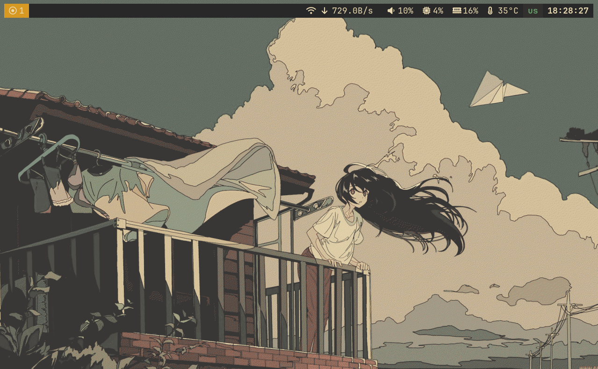
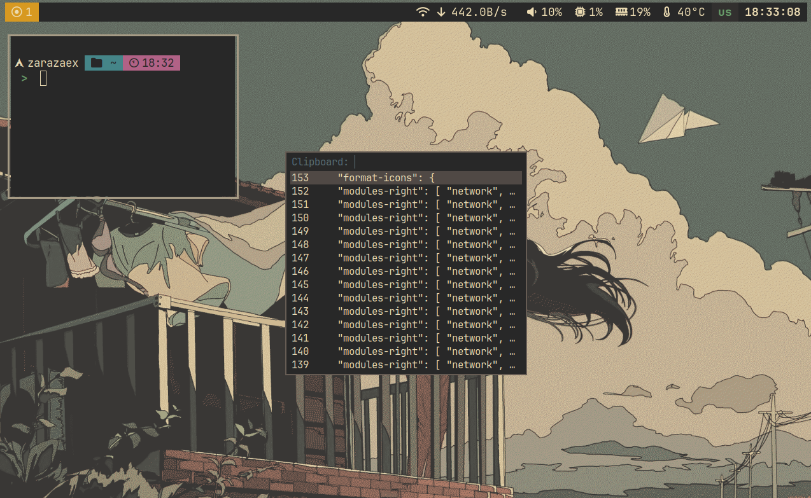
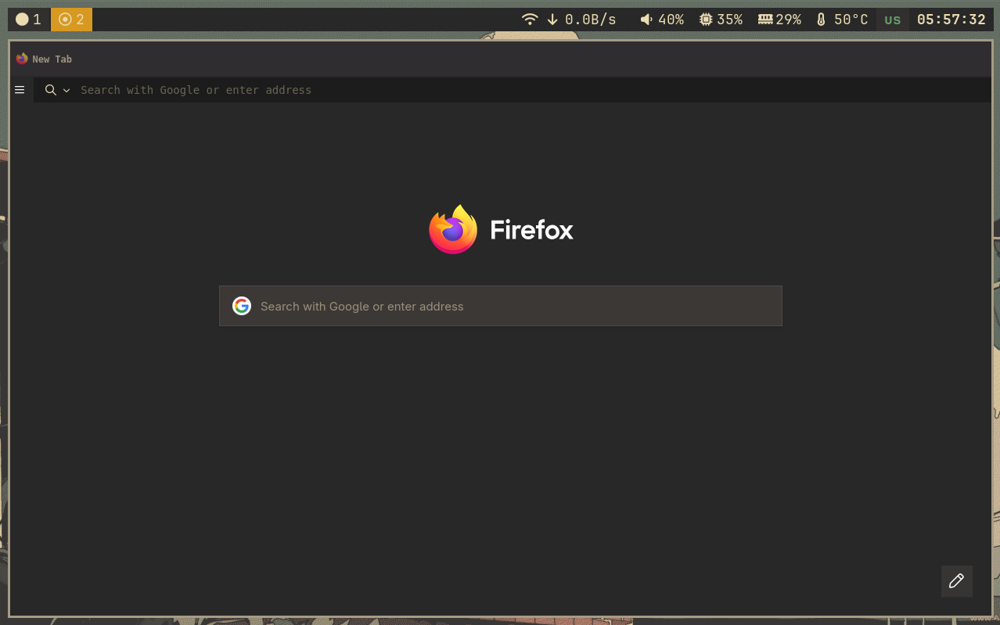
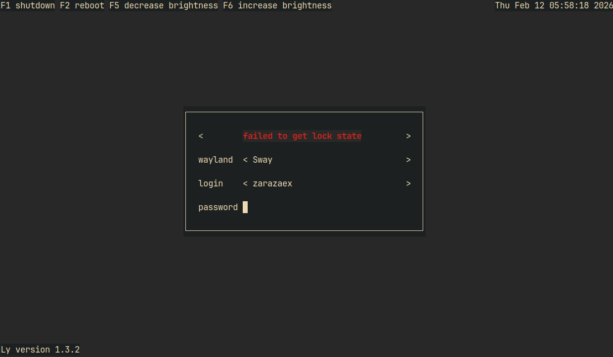

<div align="center">


</div>

# Abont
Sway dotfiles is a sway gruvbox style cfgs

# Fast start


```bash
# install fish and git 
sudo pacman -S fish git 

# clone repo 
git clone https://github.com/zarazaex69/sway-dots

# cd to repo
cd sway-dots

# run install script
fish install.fish 

# set telegram theme
t.me/addtheme/t6WoEEBSIMdPjB73 or dots/gruvbox/telegram/gruvbox.tdesktop-theme
```

### Screenshots

| Desktop | Terminals |
|---------|-----------|
|  |  |
| **Browser** | **Ly** |
|  |  |


<div align="center">


### Details
| Category            | Application |
| --------            | ----------- |
|  OS                 | Arch Linux     |
|  WM                 | Sway        |
|  Autotiling Script  | [Autotiling](https://github.com/nwg-piotr/autotiling) | 
|  Bar                | Waybar      |
|  Terminal           | Foot        |
|  Shell              | Fish + Starship |
|  Menu               | Fuzzel      |
|  File Browser       | Yazi        |
|  Terminal Multiplexer | Zellij    |
|  System Monitor     | Htop        |
|  Git Diff           | Delta       |
|  Browser            | Firefox     |
|  Login manager      | Ly          |
|  Notify             | Dunst       |
|  List Files         | Eza         |
|  Sys info           | Fastfetch   |


---

### Contact

Telegram: [zarazaex](https://t.me/zarazaexe)
<br>
Email: [zarazaex@tuta.io](mailto:zarazaex@tuta.io)
<br>
Site: [zarazaex.xyz](https://zarazaex.xyz)
<br>

</div>

[def]: screen
